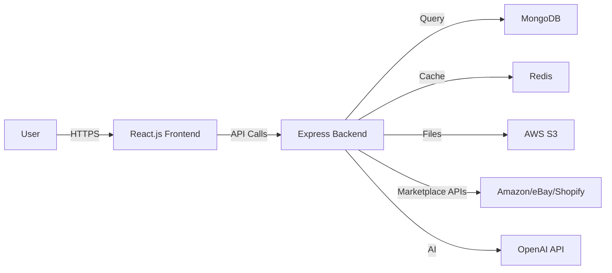

# 🛒 Market Bridge Japan

<div align="center">

### Your E-commerce Listings Across Multiple Marketplaces

[](https://youtu.be/0GSdY36gLWo)
[](https://reactjs.org/)
[](https://nodejs.org/)
[](https://www.mongodb.com/)
[](https://aws.amazon.com/)

**A comprehensive e-commerce management platform for sellers managing products across Amazon, eBay, Rakuten, and Shopify**

[Features](#-features) • [Tech Stack](#-tech-stack) • [Screenshots](#-screenshots) • [Getting Started](#-getting-started)

</div>

---

## 📖 Overview

Market Bridge Japan is a powerful **multi-marketplace management platform** designed to simplify product listing workflows for online sellers. Manage your inventory, create stunning product listings with customizable templates, and sync across multiple e-commerce platforms—all from a single dashboard.

<table>
<tr>
<td width="50%">

### 🎯 **Perfect For**
- Multi-channel e-commerce sellers
- Businesses expanding to Japanese markets
- Sellers managing large product catalogs
- Teams requiring collaborative listing tools

</td>
<td width="50%">

### 💡 **Core Value**
- **Save Time**: Manage all marketplaces in one place
- **Reduce Errors**: Consistent listings across platforms
- **Scale Faster**: Bulk operations & templates
- **Optimize**: AI-powered listing enhancements

</td>
</tr>
</table>

---

<table>
<tr>
<td width="33%" align="center">

<br/><b>📊 Dashboard Overview</b>
<br/><sub>Real-time metrics & analytics</sub>
</td>
<td width="33%" align="center">

<br/><b>🏪 Connected Marketplaces</b>
<br/><sub>Multi-platform integration</sub>
</td>
<td width="33%" align="center">

<br/><b>📋 Product List View</b>
<br/><sub>Manage all listings</sub>
</td>
</tr>

<tr>
<td width="33%" align="center">

<br/><b>🎨 HTML Template Preview</b>
<br/><sub>Customizable designs</sub>
</td>
<td width="33%" align="center">

<br/><b>🏯 Rakuten Template</b>
<br/><sub>Japanese market ready</sub>
</td>
<td width="33%" align="center">

<br/><b>🔗 Connect Accounts</b>
<br/><sub>Easy integration flow</sub>
</td>
</tr>

<tr>
<td width="33%" align="center">

<br/><b>📝 Product Form</b>
<br/><sub>Intuitive data entry</sub>
</td>
<td width="33%" align="center">

<br/><b>✏️ Rich Text Editor</b>
<br/><sub>WYSIWYG editing</sub>
</td>
<td width="33%" align="center">

<br/><b>💳 Purchase Credits</b>
<br/><sub>Secure payment flow</sub>
</td>
</tr>
</table>

---

## ✨ Features

<table>
<tr>
<td width="50%" valign="top">

### 🔐 Authentication & Security
- **Google OAuth2** integration
- Secure session management
- Multi-account support
- Role-based access control

### 🔗 Marketplace Integration
- **Amazon** Seller Central API
- **eBay** Trading API
- **Shopify** Admin API
- Real-time sync capabilities

### 📦 Product Management
- **CRUD Operations**: Create, read, update, delete
- **Bulk Upload**: CSV/Excel import
- **Image Management**: Multi-image support
- **Inventory Sync**: Real-time stock updates
- **Category Mapping**: Cross-platform categories

</td>
<td width="50%" valign="top">

### 🎨 Listing Templates
- **Pre-designed Templates**: Professional layouts
- **TinyMCE Rich Editor**: WYSIWYG product descriptions
- **HTML Customization**: Full template control
- **Template Library**: Reusable designs
- **Mobile Responsive**: Optimized for all devices

### 💳 Credit System
- **Pay-as-you-go** pricing model
- Secure **Stripe** payment integration
- Credit usage tracking
- Flexible recharge options

### 🤖 AI-Powered Tools
- **OpenAI API** integration
- Auto-generated product descriptions
- SEO optimization suggestions
- Smart content enhancement

</td>
</tr>
</table>

---

## 🛠️ Tech Stack

<table>
<tr>
<td width="33%" valign="top">

### **Frontend**
```
⚛️  React.js 18
🔄  Next.js 14
🎨  Material-UI (MUI)
📝  TinyMCE / CKEditor
🔄  Redux Toolkit
🎭  Framer Motion
```

</td>
<td width="33%" valign="top">

### **Backend**
```
🟢  Node.js 18
⚡  Express.js
🔐  Passport.js
🔑  JWT Auth
📨  Nodemailer
```

</td>
<td width="33%" valign="top">

### **Database & Cloud**
```
🍃  MongoDB Atlas
☁️  AWS S3 (Storage)
🐳  Docker
🚀  AWS ECS/Fargate
📊  Redis Cache
```

</td>
</tr>
</table>

### **Third-Party APIs**
```javascript
🛒  Amazon SP-API        |  🛍️  eBay Trading API  |  🛒  Shopify Admin API  |  🏪  Rakuten RMS API
🤖  OpenAI GPT-4o-mini   |  💳  Stripe Payment    |  🌐  Google OAuth2
```

---

## 📸 Screenshots

<table>
<tr>
<td width="33%" align="center">

<br/><b>📊 Dashboard Overview</b>
<br/><sub>Real-time metrics & analytics</sub>
</td>
<td width="33%" align="center">

<br/><b>🏪 Connected Marketplaces</b>
<br/><sub>Multi-platform integration</sub>
</td>
<td width="33%" align="center">

<br/><b>📋 Product List View</b>
<br/><sub>Manage all listings</sub>
</td>
</tr>

<tr>
<td width="33%" align="center">

<br/><b>🎨 HTML Template Preview</b>
<br/><sub>Customizable designs</sub>
</td>
<td width="33%" align="center">

<br/><b>🏯 Rakuten Template</b>
<br/><sub>Japanese market ready</sub>
</td>
<td width="33%" align="center">

<br/><b>🔗 Connect Accounts</b>
<br/><sub>Easy integration flow</sub>
</td>
</tr>

<tr>
<td width="33%" align="center">

<br/><b>📝 Product Form</b>
<br/><sub>Intuitive data entry</sub>
</td>
<td width="33%" align="center">

<br/><b>✏️ Rich Text Editor</b>
<br/><sub>WYSIWYG editing</sub>
</td>
<td width="33%" align="center">

<br/><b>💳 Purchase Credits</b>
<br/><sub>Secure payment flow</sub>
</td>
</tr>
</table>

---

## 🚀 Getting Started

### Prerequisites

```bash
Node.js >= 18.x
MongoDB >= 6.x
Docker (optional)
AWS Account (for deployment)
```

### Installation

<table>
<tr>
<td width="50%">

**1️⃣ Clone Repository**
```bash
git clone https://github.com/yourusername/market-bridge-japan.git
cd market-bridge-japan
```

**2️⃣ Install Dependencies**
```bash
# Install backend dependencies
cd backend
npm install

# Install frontend dependencies
cd ../frontend
npm install
```

</td>
<td width="50%">

**3️⃣ Environment Setup**
```bash
# Backend .env
MONGODB_URI=your_mongodb_uri
JWT_SECRET=your_jwt_secret
GOOGLE_CLIENT_ID=your_google_client_id
GOOGLE_CLIENT_SECRET=your_google_secret
AWS_ACCESS_KEY=your_aws_key
OPENAI_API_KEY=your_openai_key
```

**4️⃣ Run Application**
```bash
# Start backend
npm run dev

# Start frontend (new terminal)
cd frontend && npm run dev
```

</td>
</tr>
</table>

### 🐳 Docker Deployment

```bash
# Build and run with Docker Compose
docker-compose up -d

# Access application at http://localhost:3000
```

---

## 📊 System Architecture



---

## 🎯 Key Workflows

<table>
<tr>
<td width="50%">

### 📤 Creating a Listing
1. **Connect** marketplace account
2. **Select** product template
3. **Fill** product information
4. **Preview** with rich editor
5. **Publish** to selected platforms
6. **Track** listing performance

</td>
<td width="50%">

### 🔄 Syncing Inventory
1. **Configure** sync settings
2. **Map** product SKUs
3. **Enable** auto-sync
4. **Monitor** stock levels
5. **Receive** low-stock alerts
6. **Update** across platforms

</td>
</tr>
</table>

---

## 🌟 Project Highlights

<table>
<tr>
<td width="25%" align="center">
<h3>⚡ Performance</h3>
Fast load times with<br/>optimized caching<br/>& lazy loading
</td>
<td width="25%" align="center">
<h3>🔒 Security</h3>
OAuth2, JWT tokens,<br/>encrypted data,<br/>& API rate limiting
</td>
<td width="25%" align="center">
<h3>📱 Responsive</h3>
Mobile-first design<br/>works on all<br/>devices seamlessly
</td>
<td width="25%" align="center">
<h3>🌐 Scalable</h3>
Microservices architecture<br/>on AWS with<br/>auto-scaling
</td>
</tr>
</table>

---

## 📚 Learning Outcomes

<table>
<tr>
<td width="50%">

### 🎓 **Technical Skills Gained**
- Full-stack development with MERN stack
- OAuth2 authentication implementation
- Multi-platform API integration
- AWS cloud deployment & containerization
- Real-time data synchronization
- Payment gateway integration

</td>
<td width="50%">

### 💼 **Business Understanding**
- E-commerce marketplace dynamics
- Multi-channel selling strategies
- Product listing optimization
- Inventory management systems
- SaaS pricing models
- User experience design for sellers

</td>
</tr>
</table>

---

## 🤝 Contributing

Contributions are welcome! Please follow these steps:

1. Fork the repository
2. Create a feature branch (`git checkout -b feature/AmazingFeature`)
3. Commit your changes (`git commit -m 'Add AmazingFeature'`)
4. Push to the branch (`git push origin feature/AmazingFeature`)
5. Open a Pull Request

---

<div align="center">

**⭐ Star this repo if you find it helpful! ⭐**

Made with ❤️ for the e-commerce community

</div>
