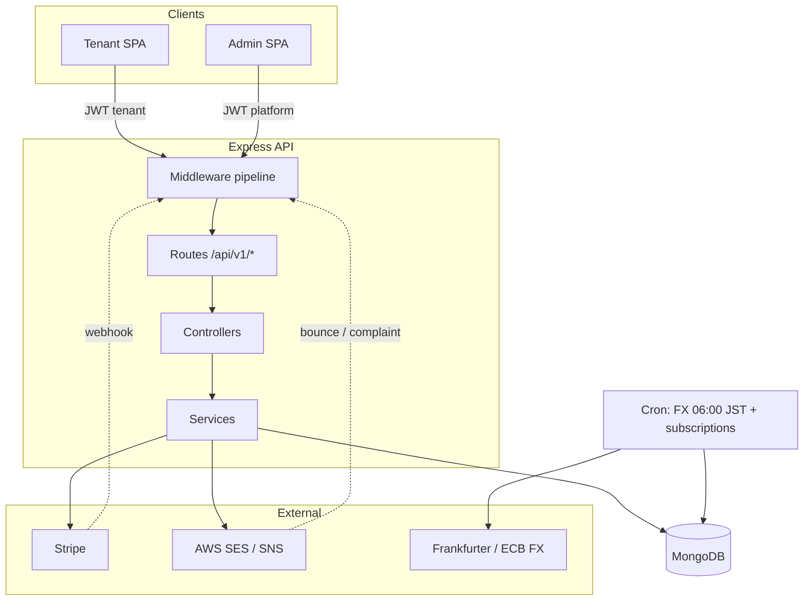
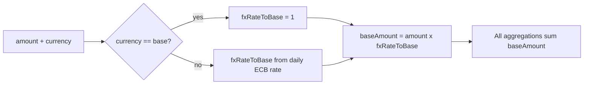

# 🏭 Stockra

<div align="center">

### Multi-Tenant ERP & Inventory Management — Built for Japan

[](https://dashboard.stockra.jp)
[](https://react.dev/)
[](https://mui.com/)
[](https://nodejs.org/)
[](https://www.mongodb.com/)
[](https://stripe.com/)
[](https://aws.amazon.com/)

**A multi-tenant B2B/B2C ERP and inventory platform with first-class multi-currency, batch costing, and locale-correct Japanese invoicing — live in Japan, architected for international expansion.**

[Overview](#-overview) • [Features](#-features) • [Tech Stack](#️-tech-stack) • [Architecture](#-architecture) • [Screenshots](#-screenshots) • [Engineering Highlights](#-engineering-highlights)

</div>

---

## 📖 Overview

Stockra gives small-to-mid businesses a single system to run **catalog, inventory, sales, procurement, finance, and logistics** across multiple shops and warehouses. It is tenant-isolated from the ground up, handles money in `Decimal128` with **daily ECB FX synchronization**, and enforces **auditable, soft-delete-only** data for compliance. The platform is live in Japan and ships with a subscription/billing layer for SaaS operation.

SMBs outgrow spreadsheets and single-location POS tools but can't justify a six-figure enterprise ERP. Stockra closes that gap: correct multi-currency accounting, real inventory costing (not average-only), locale-correct invoicing, and role-scoped access — without the implementation cost.

<table>
<tr>
<td width="50%" valign="top">

### 🎯 **Built For**
- Multi-shop / multi-warehouse SMBs
- Businesses trading across currencies
- Japanese-market operators needing compliant invoicing
- Teams that outgrew spreadsheets but can't afford enterprise ERP

</td>
<td width="50%" valign="top">

### 💡 **Core Value**
- **True multi-tenancy** — isolation by construction, not row-filtering
- **Correct money** — `Decimal128` + daily FX, never floats
- **Real costing** — FIFO or weighted-average, per organization
- **Compliance-first** — soft-delete only, full audit trail, RBAC

</td>
</tr>
</table>

---

## 🧩 What's Inside

<table>
<tr>
<td width="50%" valign="top">

- 📦 **Catalog** — products, variants, brands, categories, bundles, price books, channels
- 🏬 **Inventory** — stock items, immutable ledger, batches, transfers, adjustments, cycle counts, bins, reorder rules
- 🧾 **Sales** — sales orders, quotations, invoices, returns, customers
- 🚚 **Procurement** — purchase orders, multi-level approvals, goods receipts, suppliers

</td>
<td width="50%" valign="top">

- 💴 **Finance** — multi-currency, exchange rates, tax rates, payments
- 📮 **Logistics** — shipments, multi-carrier shipping providers
- 🛡️ **Platform** — organizations, subscriptions & billing, audit log, impersonation
- 🌐 **Localization** — bilingual EN/JA UI, Japanese invoicing, bilingual API errors

</td>
</tr>
</table>

---

## ✨ Features

<table>
<tr>
<td width="50%" valign="top">

### 🏢 Multi-Tenancy
- Tenant scope resolved once, per request
- Every query auto-scoped to the organization
- Shop- and warehouse-level access control
- Platform admin console for the SaaS operator

### 💱 Multi-Currency
- All money stored as `Decimal128`
- Canonical `baseAmount = amount × fxRateToBase`
- Daily ECB rate synchronization (06:00 JST)
- Aggregations always settle in the base currency

### 📦 Inventory & Costing
- `StockItem` as the single source of truth for quantities
- Immutable, append-only stock ledger (full audit trail)
- Batch layers with expiry tracking
- **FIFO or weighted-average** costing, per organization

</td>
<td width="50%" valign="top">

### 🧾 Sales & Procurement
- Sales orders → reservation → fulfillment → COGS
- Purchase orders with multi-level approval workflow
- Quotations that convert to orders
- Returns, invoices, and payment records

### 💳 Billing & Subscriptions
- Stripe-backed subscription plans
- Server-enforced plan limits
- Idempotent webhook handling
- Provider seam for regional payment methods

### 🔐 Security & Compliance
- Dual-secret JWT (separate tenant / platform auth)
- Role-based access control (RBAC)
- Audited, time-boxed impersonation
- Soft-delete only — nothing is ever hard-deleted

</td>
</tr>
</table>

---

## 🛠️ Tech Stack

<table>
<tr>
<td width="33%" valign="top">

### **Frontend**
```
⚛️  React 19
🎨  MUI 7
⚡  Vite 5 (twin builds)
🧭  React Router 7
🔄  SWR 2
📝  React Hook Form + Zod
🌐  Custom i18n (EN / JA)
🎯  Iconify · Inter · IBM Plex Mono
```

</td>
<td width="33%" valign="top">

### **Backend**
```
🟢  Node.js + Express 4
🍃  Mongoose 6 (MongoDB)
🔢  decimal.js (Decimal128)
🔐  JWT (dual-secret)
✅  Joi validation
⏱️  node-cron
✉️  Nodemailer (AWS SES)
```

</td>
<td width="33%" valign="top">

### **Data & Cloud**
```
🍃  MongoDB
💳  Stripe (billing + webhooks)
☁️  AWS S3 / SES / SNS
💱  Frankfurter (ECB FX)
🐳  Dockerized backend
▲   Vercel-hosted frontend
```

</td>
</tr>
</table>

---

## 📐 Architecture

Two separate single-page apps — a **tenant dashboard** and a **platform-admin console** — talk to one Express API. The API runs an ordered middleware pipeline (auth → tenant scope → org lock → RBAC → FX population → subscription/shop checks), routes into domain controllers and services, and persists to MongoDB. Cron jobs and external integrations (Stripe, AWS SES/SNS, Frankfurter) sit alongside.



**The money invariant.** Every monetary value carries its own currency, FX rate, and a pre-computed base amount — so reports never sum mixed currencies by accident.



---

## 📸 Screenshots

<table>
<tr>
<td colspan="2" align="center">

<br/><b>📊 Shop Dashboard</b>
<br/><sub>Live KPIs, task queue & stock flow — bilingual JA/EN UI</sub>
</td>
</tr>
<tr>
<td width="50%" align="center">

<br/><b>🧾 Sales Order Detail</b>
<br/><sub>Line items, tax, fulfillment timeline & gross margin</sub>
</td>
<td width="50%" align="center">

<br/><b>🏬 Bin & Rack Management</b>
<br/><sub>Warehouse bin grid with capacity & utilization</sub>
</td>
</tr>
</table>

---

## 🔬 Engineering Highlights

<table>
<tr>
<td width="25%" align="center">
<h3>🏢 Multi-Tenant</h3>
Scope resolved per request<br/>& auto-injected into<br/>every query
</td>
<td width="25%" align="center">
<h3>💱 Multi-Currency</h3>
Decimal128 money with<br/>a canonical base amount<br/>& daily FX
</td>
<td width="25%" align="center">
<h3>🧾 Auditable</h3>
Soft-delete only,<br/>append-only ledger,<br/>full audit trail
</td>
<td width="25%" align="center">
<h3>🚀 Scalable</h3>
Stateless API, twin<br/>SPA builds, multi-replica<br/>safe cron jobs
</td>
</tr>
</table>

- **Tenant isolation by construction** — the request's organization is stored in `AsyncLocalStorage` and a Mongoose guard plugin injects it (plus a soft-delete filter) into every query automatically. Application code never hand-filters tenant IDs.
- **Money done right** — all amounts are `Decimal128`; each value carries `{ currency, amount, fxRateToBase, baseAmount, rateDate }` with the invariant `baseAmount = amount × fxRateToBase`. Every aggregation settles on `baseAmount`, so mixed-currency totals are impossible.
- **Real inventory costing** — `StockItem` is the source of truth for quantities, an append-only stock ledger records every movement, and batch layers drive **FIFO or weighted-average** costing (selectable per organization) feeding gross-profit and margin.
- **Locale-correct output** — a bilingual (EN/JA) interface, Japanese invoicing, and bilingual API error messages `{ en, ja }` surfaced consistently to the client.
- **SaaS-native** — Stripe subscriptions with server-enforced plan limits and idempotent webhook processing, behind a provider seam for regional payment methods.
- **Two front-ends, one system** — a tenant dashboard and a platform-admin console ship as **twin Vite builds** with separate auth contexts and route trees.

---

## 🌐 Live Demo

Stockra is running in production in Japan:

**➡️ [dashboard.stockra.jp](https://dashboard.stockra.jp)**

> This is a commercial, multi-tenant SaaS product. This page is a portfolio showcase of the system's architecture and capabilities; the source code is private.

---

<div align="center">

**Built in Japan 🇯🇵 · architected for the world 🌏**

[](https://dashboard.stockra.jp)
[](https://tanvir-hasan-tanshen.com/)
[](mailto:tanvir.tokyojp@gmail.com)

<sub>Part of the <a href="../README.md">Tanvir Hasan Tanshen · Project Documentation</a> portfolio.</sub>

</div>
